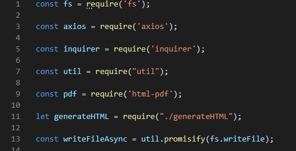

# GitHubProfileGenerator
A GitHub Profile Generator

This GitHub profile generator asks for the user's favorite color and GitHub profile picture.  When the user enters thier username, a pdf of information from thier GitHub profile along with thier username in thier favorite color.

Here I am making the variables needed for the application.

This is the first prompt which asks what the user's favorite color is.

This is the prompt that asks the user what thier gitub username is.

This writes the GitHub information to a PDF.

This is the html that is written for the GitHub information to go into.
